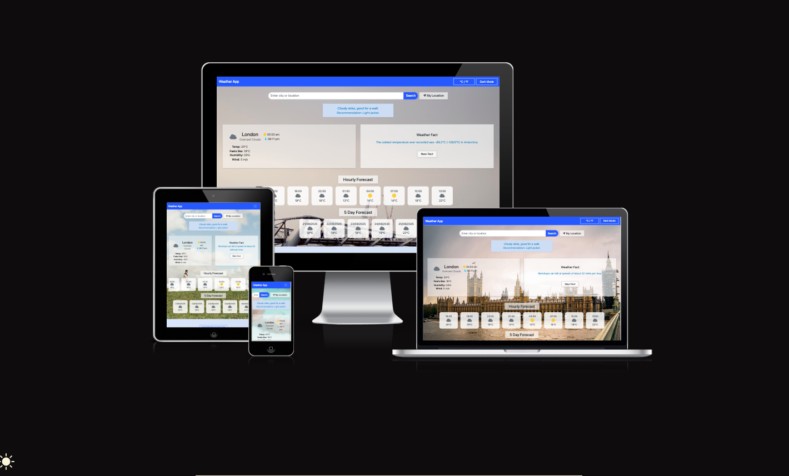
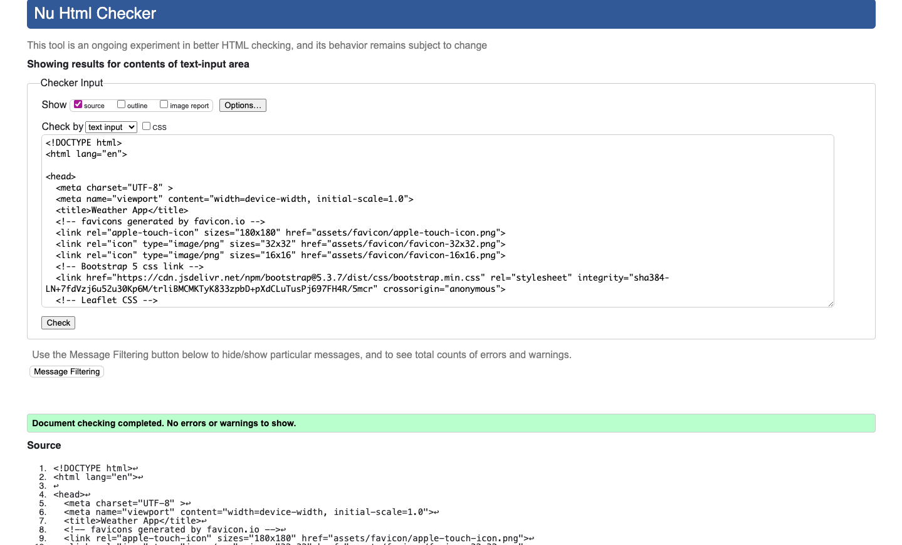
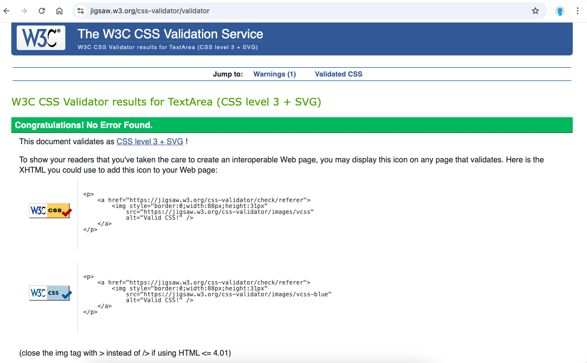
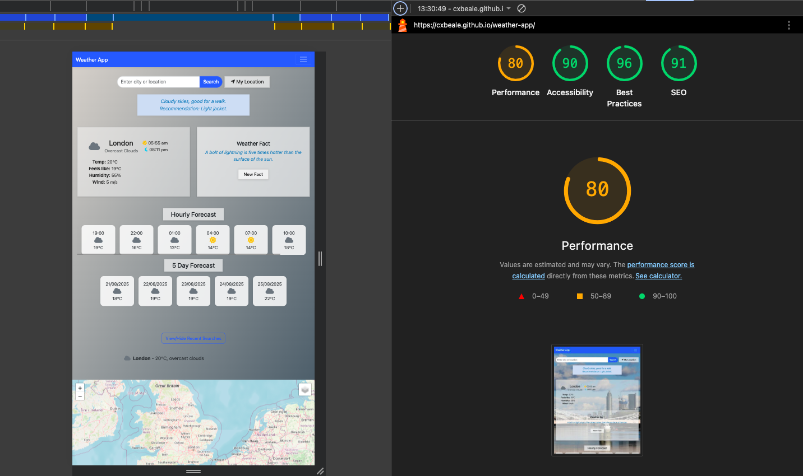

# 🌦️ Weather App

Project Board
This project followed Agile methodology, with tasks tracked on a project board to manage user stories, features, and bugs. Early deployment ensured continuous visibility of changes during development.

Overview
The Weather App is a responsive, interactive web application that provides real-time weather data, forecasts, and fun facts for any searched location. It allows users to search by city, auto-detect their location, toggle between Celsius and Fahrenheit, switch between light/dark themes, and view results on an interactive map.
This project demonstrates the integration of multiple APIs, Bootstrap components, Leaflet maps, and JavaScript DOM manipulation to create a dynamic and user-friendly interface.

Features

- Search by city/location – fetches real-time weather data
- Geolocation auto-detect – detect user’s location and show current weather
- Current weather details – temperature, conditions, icons, etc.
- Hourly & daily forecast – displayed in horizontally scrollable cards
- Weather fun facts – random fact generator with refresh button
- Favourites list – save commonly checked cities
- Compare cities – view multiple locations’ weather side by side
- Interactive map – Leaflet map centres on searched/detected location
- Dark mode toggle – switch between light and dark themes
- Unit toggle – °C / °F conversion
- 404 error page – custom styled error page for broken links

User Experience (UX)
Target Audience

- People who want a quick and accessible way to check the weather
- Travellers planning trips or daily commutes
- Learners interested in how weather apps integrate with APIs and maps

User Stories

- As a user, I want to search for a city so I can see its current weather.
- As a user, I want to auto-detect my location so I don’t need to type it.
- As a user, I want to switch between °C and °F.
- As a user, I want to save favourite cities for quick access.
- As a user, I want to compare weather in multiple cities.
- As a user, I want the app to look good in both dark and light mode.
- As a user, I want to see hourly and daily forecasts.
- As a user, I want to see my searched city on a map.

Wireframes
Wireframes were created before development to guide layout and design:

Design Choices
Color Scheme

- Light gradient backgrounds to represent different weather conditions (sunny, rainy, cloudy, snowy).
- Dark mode support for readability in low-light environments.
Fonts
- Standard system fonts for readability.
- Slightly larger, bold fonts for key weather data (temperature, city names) for better visibility.

Technologies Used

- HTML5 – basic structure of the app
- CSS3 – styling, layout, colour schemes
- Bootstrap 5 – responsive grid system and UI components
- JavaScript (ES6+) – DOM manipulation, API integration
- Leaflet.js – map integration
- Font Awesome – icons
- OpenWeatherMap API – fetch real-time weather and forecast data
- GitHub Pages – deployment of the live app

API Integration
The OpenWeatherMap API is used to retrieve real-time weather and 5-day forecast data based on user input.

- Fetch is used to make asynchronous API calls.
- Responses are processed in JSON format.
- DOM is dynamically updated with weather information including temperature, conditions, and forecast cards.

File Structure
bash:

WeatherApp
│── index.html               (main app UI)
│── 404.html                 (custom 404 page)
│── assets/
│   ├── css/style.css  (custom styles)
│   ├── js/script.js       (main JavaScript logic)
│   ├── favicon/            (favicon files)
│── wireframes.png   (wireframes image)

Setup & Installation

1. Clone the repository:

   ```bash
   git clone https://github.com/your-username/weather-app.git
   cd weather-app
   ```

2. Open `index.html` in your browser.

3. Replace the placeholder API key in `script.js` with your own from OpenWeatherMap:

   ```js
   const apiKey = "415b5436af0634bd2fea085e6b03c4e4";
   ```

4. Run locally using Live Server in VSCode for best results.

Deployment
The app is deployed via GitHub Pages:
Live App URL: [https://cxbeale.github.io/weather-app/]

 Website Screenshots

Below are screenshots of the website displayed on desktop, tablet, and mobile devices:


Testing

HTML Validation

- Validated using W3C Markup Validation Service – no major errors.



CSS Validation

- Validated using W3C CSS Validator – no critical errors.


Accessibility

- Google Lighthouse Audit reports a high accessibility score, ensuring the site is usable by people with disabilities.

Browser & Device Testing

Tested on:

- ✅ iPhone (Safari, Chrome)
- ✅ Desktop (Mac/Windows)
- ✅ Chrome Developer Tools (responsive modes)
- ✅ Browsers: Chrome, Edge, Safari

The site functioned as expected across all tested devices and browsers.

Bugs

- Some API calls may fail if an invalid city name is entered.
- Reloading the page clears favourites and compare list (localStorage persistence planned as future enhancement).

Future Enhancements

- Save favourites and compare cities using localStorage.
- Add humidity, wind speed, sunrise/sunset data.
- Loading spinners while fetching API data.
- Improve accessibility with ARIA roles and keyboard navigation.
- Add additional API integration for air quality index.

Credits

- OpenWeatherMap API – real-time weather data
- Bootstrap – responsive framework and components
- Leaflet.js – map integration
- Font Awesome – icons
- Google Fonts – for readable typography
- Favicon.io – for favicon generation
- Code Institute – project templates and guidance
- Team Members:
  - Christian Beale
  - Nick Ncube
  - Soumya Sharma
  - Idil Ismail

License
This project is for educational purposes and coursework submission.
